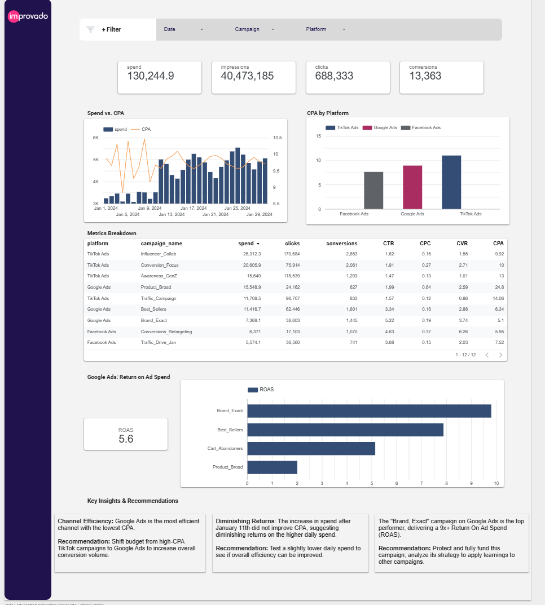

# Senior Marketing Analyst - Technical Assignment

## Overview
This project fulfills the technical assignment for the Senior Marketing Data Analyst role at Improvado. The goal was to ingest, model, and visualize multi-channel marketing data from Facebook Ads, Google Ads, and TikTok Ads to provide actionable, cross-channel insights.

The entire project was developed using a professional data stack to simulate a real-world analytics workflow.

---

## Final Deliverables

* **Live Dashboard:** [**Click here to view the live Looker Studio Dashboard**](https://lookerstudio.google.com/reporting/b29c8295-97de-4796-a066-05d42dde2bc7)
* **dbt Cloud Project:** The code in this repository is managed and executed via dbt Cloud.

---

## Final Dashboard

---

## Technical Stack

* **Data Warehouse:** Google BigQuery
* **Data Transformation:** dbt (data build tool)
* **Data Visualization:** Google Looker Studio
* **Version Control:** Git / GitHub

---

## Architectural Decisions

For this assignment, I chose to implement a complete dbt pipeline rather than performing a simple manual CSV upload to BigQuery. This decision was made to demonstrate a professional, scalable, and robust approach to analytics engineering.

The raw data was loaded using dbt seed, which is ideal for a self-contained project with static files. However, in a real-world production environment, I would advocate for a more scalable architecture where data is landed in a cloud storage bucket (like GCS) and loaded into BigQuery via external tables, which would then be defined as sources in dbt.

**Benefits of the dbt Pipeline Approach:**

* **Reproducibility:** The entire transformation logic is captured in version-controlled code (`rpt_marketing_all_channels.sql`), making the process fully transparent and reproducible.
* **Data Quality:** By defining data types in the `dbt_project.yml` file (`seeds` config), we ensure data is loaded correctly, preventing common errors like the data type mismatch encountered with the Google Ads `conversion_value` field.
* **Scalability:** The modular design (staging CTEs unioned into a final model) allows for easy addition of new data sources (e.g., LinkedIn Ads) with minimal changes to the core logic.
* **Lineage & Documentation:** dbt automatically generates a dependency graph, providing clear data lineage.

### Data Model Lineage

This graph shows how the raw source data is transformed into the final unified model used by the dashboard.

